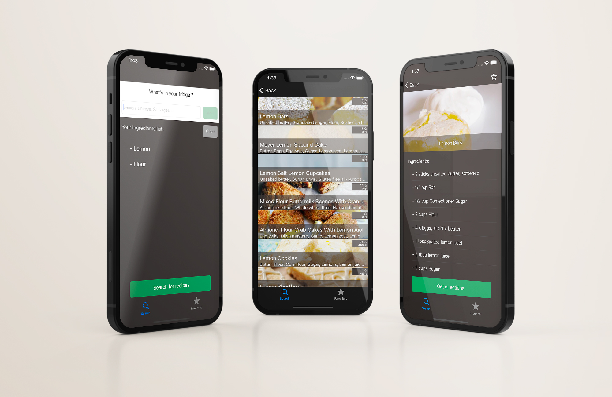

# Reciplease project
## Reciplease :  Tell us what's in your fridge, we will tell you what to cook

Have you ever opened your fridge and thought: *What am I gonna cook with those?!*, then turning back to your computer with the hope your favorite search engine will feed you with an amazing recipe...
2 hours later, you still haven't found what to do with the two weeks old cabbage still rotting in your fridge and now you are starving. What if you had an app listing recipes based on the ingredients in your fridge?! 

We heard you and developed Reciplease.

With Reciplease get a list of amazing recipes based on the ingredients you already have. You can also save your favourite recipes to retrieve them easily later and prepare them again and again and again...

Enjoy Reciplease and cook safely

## Additional information
* Support several iOS device screen sizes (from iPod touch 7th Gen to iPhone 13 Pro Max)
* Favourite recipes details can be consulted offline
